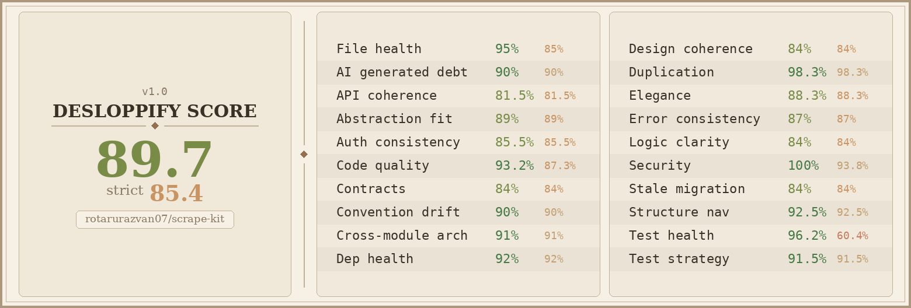

# scrape-kit



[](https://github.com/rotarurazvan07/scrape-kit/actions/workflows/CI.yml)
[](https://www.python.org/downloads/)
[](LICENSE)

A Python library you install into another project for anti-detection fetching, fuzzy entity matching, SQLite storage, and YAML settings. You call the public API from `scrape_kit`.

Requires Python 3.11+.

## Install

```bash
pip install git+https://github.com/rotarurazvan07/scrape-kit.git@v0.2.1
scrapling install
```

`scrapling install` downloads the browser binaries that `fetch()`, `scrape()`, and `browser()` need.

Without a version pin:

```bash
pip install git+https://github.com/rotarurazvan07/scrape-kit.git
```

## What it does

| Capability | Guide |
| --- | --- |
| Fetch HTML with retries and automatic stealth-browser escalation | [Fetching](docs/fetcher.md) |
| Drive a persistent browser session (click, scroll, Cloudflare) | [Fetching](docs/fetcher.md) |
| Scrape URL lists in fast HTTP or stealth mode | [Fetching](docs/fetcher.md) |
| Match noisy entity names against a known set | [Matching](docs/matching.md) |
| Persist, buffer, and merge SQLite datasets | [Storage](docs/storage.md) |
| Load and write a directory of YAML settings | [Settings](docs/settings.md) |
| Catch domain failures (`ScrapeKitError` and subclasses) | [Errors](docs/errors.md) |
| Colourised logging and function timing | [Logging](docs/logging.md) |

Usage for every public name is in the [usage guide](docs/index.md). Import from `scrape_kit`.

## License

See [LICENSE](LICENSE).
